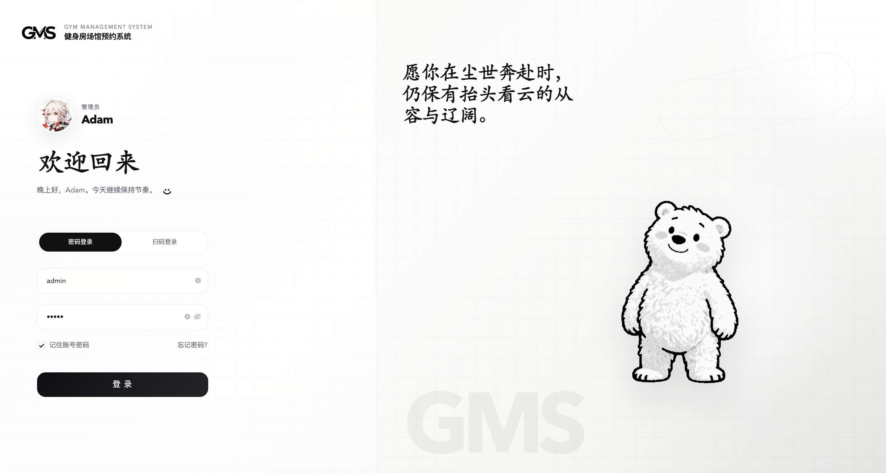
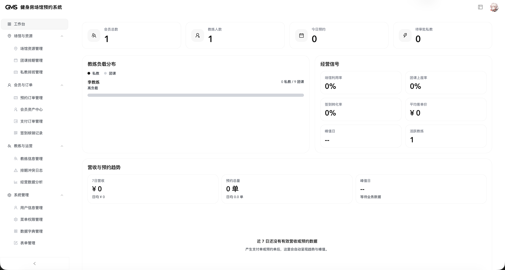
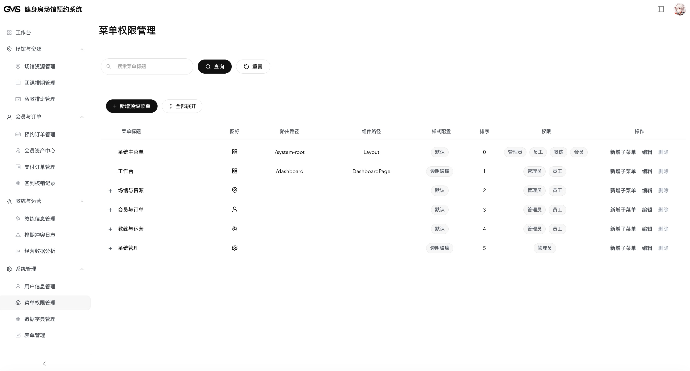

# Gym Management System

Gym Management System (`GMS`) 是一个面向健身房场馆运营场景的多模块管理系统，覆盖场馆预约、课程排期、私教排班、会员资产、签到核销、支付订单、教练工作台以及后台运营配置等核心流程。

本仓库当前包含三个主要模块：

- `gym-backend`：Spring Boot 后端服务
- `my-project`：Vue 3 管理后台（Ant Design Vue + shadcn-vue 组件体系）
- `gym-miniapp`：UniApp 会员端/教练端小程序骨架

## 1. 项目介绍

GMS 的目标不是只做一个“预约页面”，而是把健身房日常运营里最常见的管理动作串起来，形成一个完整的业务闭环，包括：

- 场馆资源管理
- 团课排期管理
- 私教排班管理
- 预约订单管理
- 会员资产中心
- 支付订单管理
- 签到核销记录
- 教练信息与用户信息管理
- 菜单权限、数据字典、动态表单配置
- 经营数据分析

从仓库结构看，这个项目已经具备“后台管理 + 后端接口 + 小程序端”的基础形态，适合作为课程设计、毕业设计、练手项目或者内部原型系统继续演进。

## 2. 项目目的

本项目主要解决以下问题：

1. 将线下健身房的预约、签到、课程、教练、会员资产等流程数字化。
2. 为管理人员提供统一后台，减少人工登记和跨表维护成本。
3. 为会员端和教练端提供清晰的业务入口，降低使用门槛。
4. 为后续扩展支付、营销、数据分析、权限配置等能力提供基础架构。

## 3. 核心功能

### 后台管理端

- 工作台总览
- 场馆资源管理
- 团课排期管理
- 私教排班管理
- 预约订单管理
- 会员资产中心
- 支付订单管理
- 签到核销记录
- 教练信息管理
- 器材管理
- 排期冲突日志
- 经营数据分析
- 菜单权限管理
- 数据字典管理
- 表单配置管理

### 小程序端

- 会员登录
- 会员首页
- 场馆浏览
- 课程浏览
- 教练浏览
- 预约管理
- 签到核销
- 钱包/资产查看
- 教练端审批与工作台页面骨架

### 后端服务

- 用户认证与 JWT 鉴权
- MySQL 持久化
- Redis 支持
- 初始化 SQL 自动执行
- 会员、教练、预约、支付、签到、课程等业务接口

## 4. 技术栈

### 后端

- Java 17
- Spring Boot 3
- Spring Web
- Spring Security
- MyBatis-Plus
- MySQL 8
- Redis
- JWT (`jjwt`)
- Lombok
- Maven

### 前端后台

- Vue 3
- Vite
- TypeScript
- Vue Router
- Vuex
- Ant Design Vue
- shadcn-vue
- Reka UI（作为 shadcn-vue 的底层无样式组件能力）
- Tailwind CSS 4
- ECharts
- Unovis
- Axios

说明：

- 当前管理后台并不是单一 UI 方案，而是 `Ant Design Vue` 业务页面能力与 `shadcn-vue + Reka UI + Tailwind CSS 4` 组件体系并存。
- 项目中已存在 `my-project/components.json`，说明前端已经接入了 `shadcn-vue`。

### 小程序端

- UniApp
- Vue 单文件组件
- HBuilderX / UniApp 兼容工具链

### 界面参考

以下截图已同步放入仓库 `docs/readme-assets/` 目录，可直接作为 README 展示和界面参考。

#### 登录页



#### 管理后台工作台



#### 菜单权限管理页



## 5. 系统架构

```text
my-project (Vue Admin)
        |
        |  开发环境代理请求
        v
gym-backend (Spring Boot API, port 9090)
        |
        +--> MySQL (gym_db)
        |
        +--> Redis

gym-miniapp (UniApp Client)
        |
        +--> gym-backend
```

说明：

- 后台前端开发环境通过 Vite 代理把接口请求转发到 `http://localhost:9090`
- 后端启动时会自动执行 `schema.sql`、`db_menu.sql`、`db_update.sql`
- 数据库名默认为 `gym_db`，配置中开启了 `createDatabaseIfNotExist=true`

## 6. 目录结构

```text
vue-project/
├── README.md
├── gym-backend/              # Spring Boot 后端
│   ├── pom.xml
│   └── src/main/resources/
│       ├── application.yml
│       ├── schema.sql
│       ├── db_menu.sql
│       └── db_update.sql
├── my-project/               # Vue 3 管理后台
│   ├── package.json
│   ├── vite.config.ts
│   └── src/
│       ├── views/
│       ├── components/
│       ├── router/
│       └── api/
└── gym-miniapp/              # UniApp 小程序端
    ├── package.json
    ├── manifest.json
    ├── pages.json
    └── pages/
```

## 7. 环境要求

建议本地开发环境至少满足：

- JDK 17
- Maven 3.8+
- Node.js 18+
- npm 9+
- MySQL 8.x
- Redis 6.x 或以上
- HBuilderX（如果需要运行 UniApp 小程序）

## 8. 快速开始

### 8.1 克隆项目

```bash
git clone https://github.com/AdamButterfiled/gym-management-system.git
cd gym-management-system
```

### 8.2 配置数据库和 Redis

后端配置文件位于：

- `gym-backend/src/main/resources/application.yml`

当前默认配置为：

- 后端端口：`9090`
- MySQL 数据库：`gym_db`
- Redis：`localhost:6379`

如果你的本地环境与默认值不同，请先修改对应配置。

### 8.3 启动后端

```bash
cd gym-backend
mvn spring-boot:run
```

启动成功后，后端服务默认运行在：

- `http://localhost:9090`

### 8.4 启动管理后台

```bash
cd my-project
npm install
npm run dev
```

说明：

- 开发环境下，前端会把接口请求代理到 `http://localhost:9090`
- 因此请先确保后端已经启动

### 8.5 运行小程序端

```bash
cd gym-miniapp
npm install
```

然后使用以下方式运行：

- 用 HBuilderX 打开 `gym-miniapp` 目录
- 或使用现有 UniApp 工具链构建微信小程序

当前仓库没有内置完整 UniApp CLI 运行链路，更适合通过 HBuilderX 打开后调试。

## 9. 默认账号

仓库中已有一组用于演示的测试账号说明：

- 管理员：`admin / admin`
- 会员：`member01 / 123456`
- 教练：`coach01 / 123456`

如果本地数据库被重新初始化或你修改了初始化脚本，账号状态可能会发生变化，请以实际数据库内容为准。

## 10. 常用命令

### 后端

```bash
cd gym-backend
mvn spring-boot:run
```

### 管理后台

```bash
cd my-project
npm install
npm run dev
npm run build
npm run preview
npm run lint
```

### 小程序端

```bash
cd gym-miniapp
npm install
npm run dev:mp-weixin
npm run build:mp-weixin
```

注意：小程序端的脚本当前主要用于提示运行方式，实际仍建议在 HBuilderX 中打开。

## 11. 配置说明

### 数据库初始化

后端配置中启用了：

```yaml
spring:
  sql:
    init:
      mode: always
```

这意味着后端每次启动时都会尝试执行初始化 SQL。开发阶段方便，但在多人协作或生产环境中要格外谨慎，避免覆盖或污染已有数据。

### 前端接口代理

管理后台使用 Vite 开发服务器，并把以下接口根路径转发到后端：

- `/api`
- `/admin`
- `/coach`
- `/course`
- `/dict`
- `/equipment`
- `/form-config`
- `/member`
- `/menu`
- `/reservation`
- `/user`
- `/venue`

因此前后端联调时，只需要保证后端服务正常运行即可。

## 12. 适用场景

本项目适合以下用途：

- 毕业设计 / 课程设计
- Java + Vue 全栈练手项目
- 健身房运营系统原型
- 场馆预约和会员管理类系统的二次开发基础仓库

## 13. 后续可优化方向

如果你准备继续把这个项目做深，优先建议补这些内容：

1. 抽离环境配置，避免把本地数据库账号密码直接写入仓库
2. 增加接口文档，例如 Swagger / OpenAPI
3. 补充单元测试和端到端测试
4. 完善权限模型与角色菜单控制
5. 增加 Docker 化部署
6. 补充 CI/CD 流程
7. 细化会员资产、支付、核销与营销闭环

## 14. 免责声明

当前仓库更接近开发态原型/课程项目，默认配置和初始化方式偏向本地开发便利性。如果要投入实际生产环境，请先补齐以下事项：

- 环境变量化配置
- 安全加固
- 密码与密钥管理
- 生产数据库迁移策略
- 日志与监控体系
- 自动化测试与发布流程
